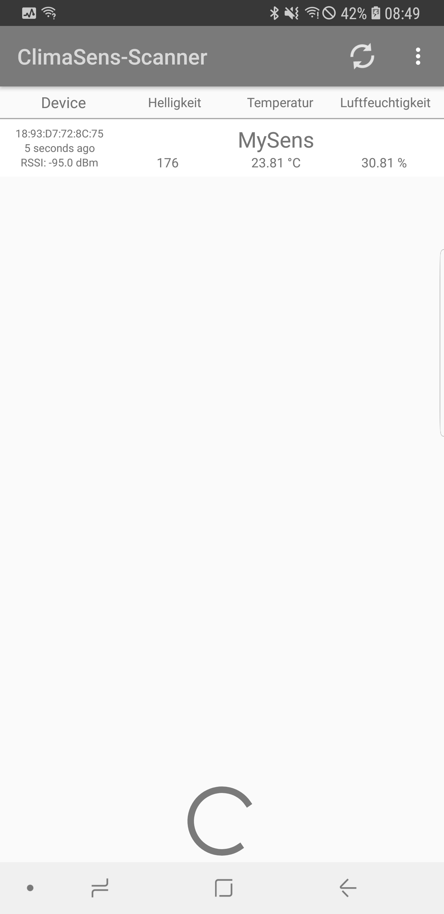
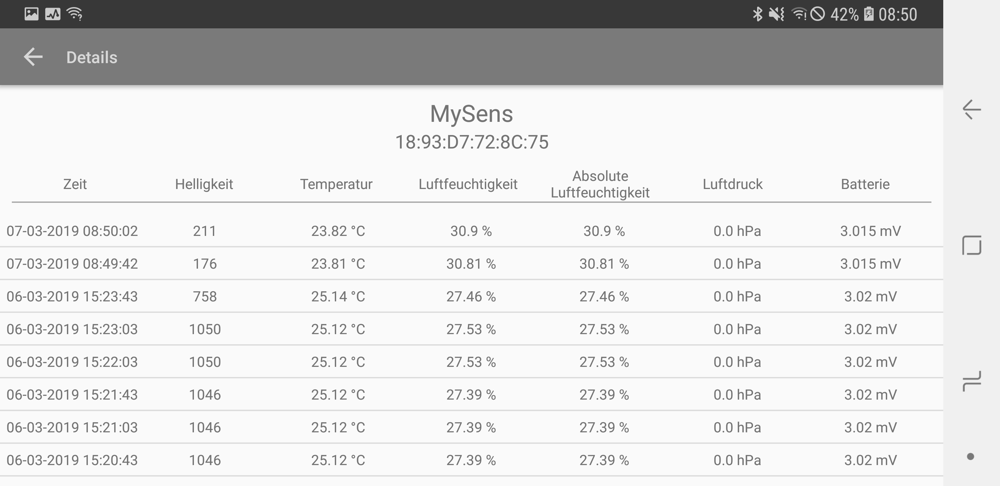

ClimaSens-Scanner
===================================

This is a Scanner App for ClimaSens-Devices.

Introduction
------------

This App allows scanning for ClimaSens-Devices with Bluetooth Low Energy.
All Data from the Sensors will be read out and displayed.
Also scanns in background.

Pre-requisites
--------------

- Android SDK 24
- Android Build Tools v27.0.2
- Android Support Repository

Screenshots
-------------

 

Getting Started
---------------

This sample uses the Gradle build system. To build this project, use the
"gradlew build" command or use "Import Project" in Android Studio.